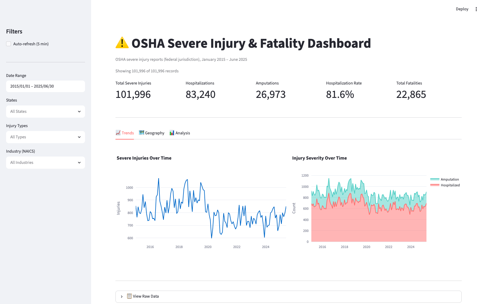

# OSHA Severe Injury & Fatality Dashboard

Interactive dashboard for exploring **101,996 severe injury reports** (Jan 2015 – Jun 2025) and **22,865 fatality/catastrophe records** reported to federal OSHA — built with Streamlit and Plotly.

**Live demo:** [osha-dashboard-cenuscpehyevclrnznyhtv.streamlit.app](https://osha-dashboard-cenuscpehyevclrnznyhtv.streamlit.app/)



## What it shows

- **KPIs** — total severe injuries, hospitalizations, amputations, hospitalization rate, and fatalities for any filtered slice
- **Trends** — monthly injury counts and severity (hospitalization vs. amputation) over a 10-year span
- **Geography** — US choropleth of severe injuries by state, with a sortable state breakdown
- **Analysis** — top industries (NAICS mapped to plain-English names), injury type distribution, body parts affected, and top injury mechanisms
- **Raw data access** — filterable record view with CSV export

Filters: date range, state, injury type (OIICS nature), and industry (NAICS).

## Data sources

| Dataset | Source | Records |
|---|---|---|
| Severe Injury Reports | [OSHA Severe Injury Reports](https://www.osha.gov/severeinjury) — employer-reported hospitalizations and amputations under 29 CFR 1904.39 | 101,996 |
| Fatality/Catastrophe Data | [OSHA fatality reports](https://www.osha.gov/fatalities) | 22,865 |

**Important caveat for interpreting this data:** severe injury reporting under 29 CFR 1904.39 covers **federal OSHA jurisdiction only**. The 20+ State Plan states that operate their own programs (California, Washington, Michigan, and others) are absent or undercounted here — which is why Texas, Florida, and Ohio dominate the map. Counts reflect *reported* events, not incidence rates; they are not normalized by employment. This is a known limitation of the dataset, not a finding.

## Run locally

```bash
git clone https://github.com/dgrinnell/osha-dashboard.git
cd osha-dashboard
python3 -m venv .venv && source .venv/bin/activate
pip install -r requirements.txt
streamlit run app.py
```

## Project structure

```
osha-dashboard/
├── app.py                 # Streamlit entry point: layout, filters, KPIs, tabs
├── src/
│   ├── data_loader.py     # Cached data loading with optimized dtypes
│   ├── charts.py          # Plotly chart builders
│   └── utils.py           # NAICS and state lookup tables
├── data/
│   ├── severe_injuries.csv
│   └── fatalities.xlsx
└── .streamlit/config.toml # Theme
```

Performance notes: columns load with categorical/32-bit dtypes to keep the 100k-row dataset memory-light, and `st.cache_data` (5-min TTL) avoids re-parsing on every interaction.

## Deploy your own

1. Fork or clone this repo to your GitHub account
2. Sign in at [share.streamlit.io](https://share.streamlit.io) with GitHub
3. **New app** → select the repo, branch `main`, main file `app.py` → **Deploy**

## About

Built by [Dan Grinnell](https://ai4ehs.com), MS, CIH — Certified Industrial Hygienist working at the intersection of AI, data, and EHS practice. More at [ai4ehs.com](https://ai4ehs.com) and the [AI 4 EHS newsletter](https://substack.com/@ai4ehs).

## License

MIT
